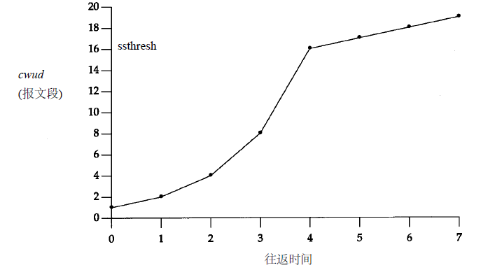

# tcp的连接和断开

#  滑动窗口机制

# 拥塞避免算法

拥塞避免和慢启动为作用于不同对象的独立的算法。当拥塞发生时，我们希望减慢网络中数据包的传输速率，然后调用慢启动使继续。

## 混合算法操作

1. 初始化一个给定的连接时，将 cwnd 设置为 segsize （一个数据段的大小），将 ssthresh 设置为 65535字节。
2. TCP output  常规不会发送超过 cmnd 和接收端通告窗口的最小值。拥塞避免是发送端利用的控制流，通告窗口是接收端利用的控制流。前者基于发送端对网络拥塞感知的评估。后者和接收端对这次连接的可用缓冲空间的数量有关。
3. 拥塞发生时（超时或者接收到了重复的 ACK ）, 将 ssthresh 设置为当前窗口大小的一半（cwnd 和 接收端通告窗口的最小值， 但至少是两个数据段的大小）。此外，如果是因为超时导致的拥塞，则将 cwnd 设置为一个数据段的大小。
4. 当另一端确认了新的数据，cwnd 增加。 但是增加的方式取决于是否在执行慢启动或者拥塞避免。 如果 cwnd  <=  ssthresh , 则执行慢启动。否则，执行拥塞避免。继续执行慢启动直到出现拥塞。然后执行拥塞避免。 慢启动开始，cwnd 设置为一个数据段的大小，并在每次收到 ACK 时，增加一个数据段的大小。该拥塞窗口会呈指数级的增加：发送一个数据端，然后是两个，四个等等。拥塞避免规定每次收到 ACK 时， cwnd 增加  1/cwnd。对比慢启动的指数级增加，拥塞避免为累加。

# 快速重传和快速恢复算法

快速重传算法：当接受到了三个或更多的 ACK ，则一定表示有数据段丢失。然后重传丢失的数据段，而不等待重传的定时器过期。

快速恢复算法：重传丢失的数据段时，进入拥塞避免阶段，而不是慢启动。

## 实现步骤

1. 当接收到了第三个重复的 ACK （确认包）时，将  ssthresh（慢启动阶段临界值） 设置为 cwnd （当前拥塞窗口） 和 接收端通告窗口的最小值。 重传丢失的数据段。 将 cwnd 设置为 ssthresh + 3 * segsize（数据段的大小）。
2. 每次另一个重复的 ACK  到达， cwnd 增加 segsize , 传输一个数据包。（如果 cwnd  允许新的数据包的话）。
3. 当下一个确认新数据的 ACK 到达时，  将 cwnd  设置为 ssthresh 的值。此外，该 ACK  应该确认所有介于丢失的数据报和第三个 ACK  接收之间的数据段。